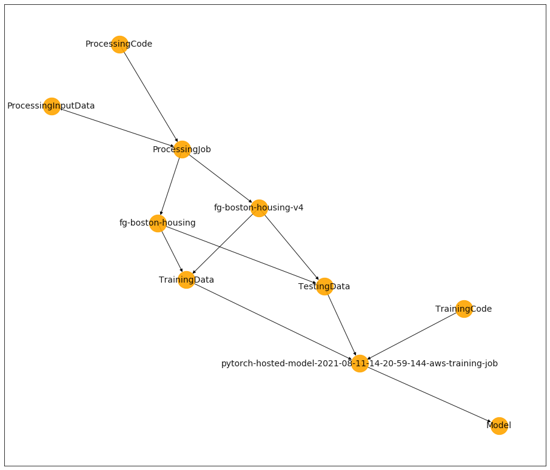
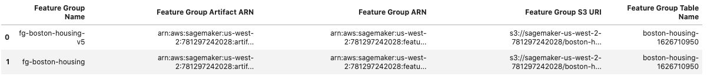

# ML Lineage Helper

This library is a wrapper around the SageMaker SDK to support ease of lineage tracking across the ML lifecycle. Lineage artifacts include data, code, feature groups, features in a feature group, feature group queries, training jobs, and models.

## Install

`pip install git+https://github.com/aws-samples/ml-lineage-helper`

## Usage

Import `ml_lineage_helper`.

```python
from ml_lineage_helper import *
from ml_lineage_helper.query_lineage import QueryLineage
```

### Creating and Displaying ML Lineage

Lineage tracking can tie together a SageMaker Processing job, the raw data being processed, the processing code, the query you used against the Feature Store to fetch your training and test sets, the training and test data in S3, and the training code into a lineage represented as a DAG.

```python
ml_lineage = MLLineageHelper()
lineage = ml_lineage.create_ml_lineage(estimator_or_training_job_name, model_name=model_name,
                                       query=query, sagemaker_processing_job_description=preprocessing_job_description,
                                       feature_group_names=['customers', 'claims'])
lineage
```

If you cloned your code from a version control hosting platform like GitHub or GitLab, `ml_lineage_tracking` can associate the URLs of the code with the artifacts that will be created. See below:

```python
# Get repo links to processing and training code
processing_code_repo_url = get_repo_link(os.getcwd(), 'processing.py')
training_code_repo_url = get_repo_link(os.getcwd(), 'pytorch-model/train_deploy.py', processing_code=False)
repo_links = [processing_code_repo_url, training_code_repo_url]

# Create lineage
ml_lineage = MLLineageHelper()
lineage = ml_lineage.create_ml_lineage(estimator, model_name=model_name,
                                       query=query, sagemaker_processing_job_description=preprocessing_job_description,
                                       feature_group_names=['customers', 'claims'],
                                       repo_links=repo_links)
lineage
```

| Name/Source                                                   | Association   | Name/Destination                                              | Artifact Source ARN                                                                                                               | Artifact Destination ARN                                                                                                          | Source URI                                                                                                   | Base64 Feature Store Query String                                | Git URL                                                                                                   |
| ------------------------------------------------------------- | ------------- | ------------------------------------------------------------- | --------------------------------------------------------------------------------------------------------------------------------- | --------------------------------------------------------------------------------------------------------------------------------- | ------------------------------------------------------------------------------------------------------------ | ---------------------------------------------------------------- | --------------------------------------------------------------------------------------------------------- |
| pytorch-hosted-model-2021-08-26-15-55-22-071-aws-training-job | Produced      | Model                                                         | arn:aws:sagemaker:us-west-2:000000000000:experiment-trial-component/pytorch-hosted-model-2021-08-26-15-55-22-071-aws-training-job | arn:aws:sagemaker:us-west-2:000000000000:artifact/013fa1be4ec1d192dac21abaf94ddded                                                | None                                                                                                         | None                                                             | None                                                                                                      |
| TrainingCode                                                  | ContributedTo | pytorch-hosted-model-2021-08-26-15-55-22-071-aws-training-job | arn:aws:sagemaker:us-west-2:000000000000:artifact/902d23ff64ef6d85dc27d841a967cd7d                                                | arn:aws:sagemaker:us-west-2:000000000000:experiment-trial-component/pytorch-hosted-model-2021-08-26-15-55-22-071-aws-training-job | s3://sagemaker-us-west-2-000000000000/pytorch-hosted-model-2021-08-26-15-55-22-071/source/sourcedir.tar.gz   | None                                                             | https://gitlab.com/bwlind/ml-lineage-tracking/blob/main/ml-lineage-tracking/pytorch-model/train_deploy.py |
| TestingData                                                   | ContributedTo | pytorch-hosted-model-2021-08-26-15-55-22-071-aws-training-job | arn:aws:sagemaker:us-west-2:000000000000:artifact/1ae9dfab7a3817cbf14708d932d9142d                                                | arn:aws:sagemaker:us-west-2:000000000000:experiment-trial-component/pytorch-hosted-model-2021-08-26-15-55-22-071-aws-training-job | s3://sagemaker-us-west-2-000000000000/ml-lineage-tracking-v1/test.npy                                        | None                                                             | None                                                                                                      |
| TrainingData                                                  | ContributedTo | pytorch-hosted-model-2021-08-26-15-55-22-071-aws-training-job | arn:aws:sagemaker:us-west-2:000000000000:artifact/a0fd47c730f883b8e5228577fc5d5ef4                                                | arn:aws:sagemaker:us-west-2:000000000000:experiment-trial-component/pytorch-hosted-model-2021-08-26-15-55-22-071-aws-training-job | s3://sagemaker-us-west-2-000000000000/ml-lineage-tracking-v1/train.npy                                       | CnNlbGVjdCAqCmZyb20gImJvc3Rvbi1ob3VzaW5nLXY1LTE2Mjk3MzEyNjkiCg== | None                                                                                                      |
| fg-boston-housing-v5                                          | ContributedTo | TestingData                                                   | arn:aws:sagemaker:us-west-2:000000000000:artifact/1969cb21bf48405e0f2bb2d33f48b7b2                                                | arn:aws:sagemaker:us-west-2:000000000000:artifact/1ae9dfab7a3817cbf14708d932d9142d                                                | arn:aws:sagemaker:us-west-2:000000000000:feature-group/boston-housing-v5                                     | None                                                             | None                                                                                                      |
| fg-boston-housing                                             | ContributedTo | TestingData                                                   | arn:aws:sagemaker:us-west-2:000000000000:artifact/d1b82165341cd78b93995d492b5adf7f                                                | arn:aws:sagemaker:us-west-2:000000000000:artifact/1ae9dfab7a3817cbf14708d932d9142d                                                | arn:aws:sagemaker:us-west-2:000000000000:feature-group/boston-housing                                        | None                                                             | None                                                                                                      |
| ProcessingJob                                                 | ContributedTo | fg-boston-housing-v5                                          | arn:aws:sagemaker:us-west-2:000000000000:artifact/0a665c42c57f3b561e18a51a327d0a2f                                                | arn:aws:sagemaker:us-west-2:000000000000:artifact/1969cb21bf48405e0f2bb2d33f48b7b2                                                | arn:aws:sagemaker:us-west-2:000000000000:processing-job/pytorch-workflow-preprocessing-26-15-41-18           | None                                                             | None                                                                                                      |
| ProcessingInputData                                           | ContributedTo | ProcessingJob                                                 | arn:aws:sagemaker:us-west-2:000000000000:artifact/2204290e557c4c9feaaa4ef7e4d88f0c                                                | arn:aws:sagemaker:us-west-2:000000000000:artifact/0a665c42c57f3b561e18a51a327d0a2f                                                | s3://sagemaker-us-west-2-000000000000/ml-lineage-tracking-v1/data/raw                                        | None                                                             | None                                                                                                      |
| ProcessingCode                                                | ContributedTo | ProcessingJob                                                 | arn:aws:sagemaker:us-west-2:000000000000:artifact/69de4723ab0643c6ca8257bc6fbcfb4f                                                | arn:aws:sagemaker:us-west-2:000000000000:artifact/0a665c42c57f3b561e18a51a327d0a2f                                                | s3://sagemaker-us-west-2-000000000000/pytorch-workflow-preprocessing-26-15-41-18/input/code/preprocessing.py | None                                                             | https://gitlab.com/bwlind/ml-lineage-tracking/blob/main/ml-lineage-tracking/processing.py                 |
| ProcessingJob                                                 | ContributedTo | fg-boston-housing                                             | arn:aws:sagemaker:us-west-2:000000000000:artifact/0a665c42c57f3b561e18a51a327d0a2f                                                | arn:aws:sagemaker:us-west-2:000000000000:artifact/d1b82165341cd78b93995d492b5adf7f                                                | arn:aws:sagemaker:us-west-2:000000000000:processing-job/pytorch-workflow-preprocessing-26-15-41-18           | None                                                             | None                                                                                                      |
| fg-boston-housing-v5                                          | ContributedTo | TrainingData                                                  | arn:aws:sagemaker:us-west-2:000000000000:artifact/1969cb21bf48405e0f2bb2d33f48b7b2                                                | arn:aws:sagemaker:us-west-2:000000000000:artifact/a0fd47c730f883b8e5228577fc5d5ef4                                                | arn:aws:sagemaker:us-west-2:000000000000:feature-group/boston-housing-v5                                     | None                                                             | None                                                                                                      |
| fg-boston-housing                                             | ContributedTo | TrainingData                                                  | arn:aws:sagemaker:us-west-2:000000000000:artifact/d1b82165341cd78b93995d492b5adf7f                                                | arn:aws:sagemaker:us-west-2:000000000000:artifact/a0fd47c730f883b8e5228577fc5d5ef4                                                | arn:aws:sagemaker:us-west-2:000000000000:feature-group/boston-housing                                        | None                                                             | None                                                                                                      |

You can optionally see the lineage represented as a graph instead of a Pandas DataFrame:

```python
ml_lineage.graph()
```



If you're jumping in a notebook fresh and already have a model whose ML Lineage has been tracked, you can get this `MLLineage` object by using the following line of code:

```python
ml_lineage = MLLineageHelper(sagemaker_model_name_or_model_s3_uri='my-sagemaker-model-name')
ml_lineage.df
```


### Querying ML Lineage

If you have a data source, you can find associated Feature Groups by providing the data source's S3 URI or Artifact ARN:

```python
query_lineage = QueryLineage()
query_lineage.get_feature_groups_from_data_source(artifact_arn_or_s3_uri)
```



You can also start with a Feature Group, and find associated data sources:

```python
query_lineage = QueryLineage()
query_lineage.get_data_sources_from_feature_group(artifact_or_fg_arn, max_depth=3)
```

Given a Feature Group, you can also find associated models:

```python
query_lineage = QueryLineage()
query_lineage.get_models_from_feature_group(artifact_or_fg_arn)
```

Given a SageMaker model name or artifact ARN, you can find associated Feature Groups.

```python
query_lineage = QueryLineage()
query_lineage.get_feature_groups_from_model(artifact_arn_or_model_name)
```

## Security

See [CONTRIBUTING](CONTRIBUTING.md#security-issue-notifications) for more information.

## License

This project is licensed under the Apache-2.0 License.
